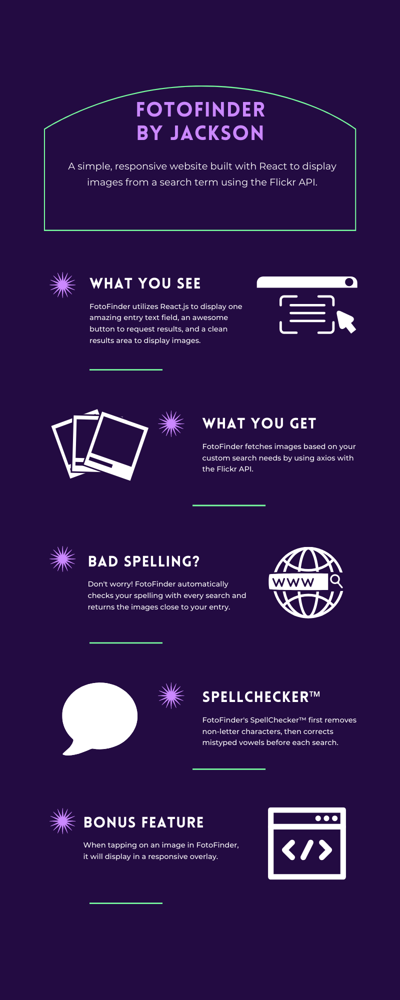

# FotoFinder
A simple, responsive website built with React to display images from a search term using the Flickr API.

## Installation and Setup Instructions

#### Details:  

Clone down this repository. You will need `node` and `npm` installed globally on your machine.  

`git clone https://github.com/jacksonmccluskey/FotoFinder.git`

Installation:

`npm install`  

To Start Server:

`npm start`  

To Visit App:

`localhost:3000` 

## Requirements and User Stories

#### Requirements:

- [x] Create a simple responsive website to display images from a search term using an image search API of your choice
- [x] Should include one text entry field
- [x] Should include a button to request results
- [x] Should include a results area to display the images in a gallery style of your choice
- [x] When tapping on an image, it should display in a responsive overlay
- [x] Implement your own spelling checker that automatically corrects some user input mistakes
  - [x] You can also use a Unix words dictionary file to assist in determining the validity of words
