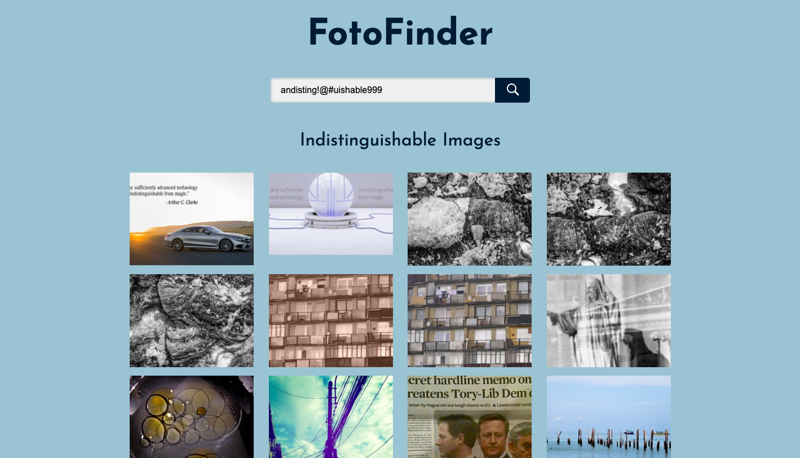
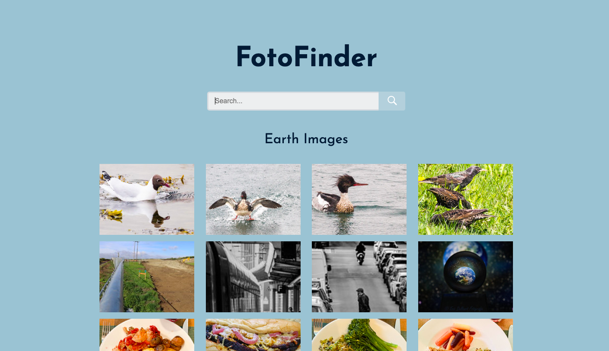
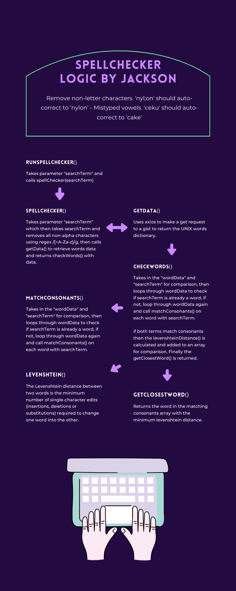

# FotoFinder [Final Project](fotofinderapp.web.app)
A simple, responsive website built with React to display images from a search term using the Flickr API.


## Installation and Setup Instructions

#### Details:  

Clone down this repository. You will need `node` and `npm` installed globally on your machine.  

`git clone https://github.com/jacksonmccluskey/FotoFinder.git`

Go to folder:

`cd FotoFinder/fotofinder`

Installation:

`npm install`  

To Start Server:

`npm start`  

To Visit App:

`localhost:3000` 

## Requirements and User Stories



#### Requirements:

- [x] Create a simple responsive website to display images from a search term using an image search API of your choice
- [x] Should include one text entry field
- [x] Should include a button to request results
- [x] Should include a results area to display the images in a gallery style of your choice
- [x] When tapping on an image, it should display in a responsive overlay
- [x] Implement your own spelling checker that automatically corrects some user input mistakes
  - [x] You can also use a Unix words dictionary file to assist in determining the validity of words
  - [x] Run your spell checker on the input word before submitting the image search requests
  - [x] Remove non-letter characters. 'nyl;on' should auto-correct to ‘nylon'
  - [x] Mistyped vowels. 'ceku' should auto-correct to ‘cake'
- [x] Make sure to take into account some error handling, and keep your code clean and organized
- [x] Create a README that documents the assumptions and decisions that you have made in designing the architecture of your site
- [x] Please host the site on Heroku or another platform of your choice [Link](fotofinderapp.web.app)

## Components

#### App.js
- Root Component
- Contains handleSubmit function
- Returns PhotoContextProvider Component

#### PhotoContext.js
- Uses Context (A way to pass data through the component tree without having to pass props down manually at every level)
- Contains Flickr API query for images
- Returns children as PhotoContext.Provider Component

#### Header.js
- Header of App
- Contains Title ("FotoFinder")
- Returns Form Component

#### Form.js
- Search Bar for App
- Contains Text Field, Search Button, & Submit Feature
- Returns Form Element

#### Search.js
- Title for Images
- Contains Image Title (searchTerm + "Images")
- Returns Container Component

#### Container.js
- Image Results Area
- Contains useEffect for searchTerm to runSearch(searchTerm)
- Returns Loader or Gallery Component

#### Gallery.js
- Image Results
- Contains Custom Image Components as Buttons or NoImages Component
- Returns images or noImages and opens LightBox Modal Component on tap

#### Loader.js
- Loading Component
- Contains Nothing
- Return Empty div

#### Item.js
- Title for Picture
- Contains Picture Title (searchTerm + "Pictures")
- Returns Container Component

#### NoImages.js
- NoImages Component
- Contains "No Images Found" Header
- Returns HTML Only

#### NotFound.js
- NotFound Component
- Contains "Page Not Found" Header
- Returns HTML Only



## Tech Stack

#### Tools & Resources Used:

- React / React Hooks (For Frontend Components)
- React Router (For Navigation)
- Context API (For Data Globalization)
- Flickr API (For Image Search)
- axios (For Fetching Data)
- Unix words (For Spell Checking)

## Spell Checker Logic



#### Retrieving the Unix Dictionary

```
import json

with open('/usr/share/dict/words') as infile:

    words = infile.read().splitlines()
    
    with open('words.json', 'w') as outfile:
    
        json.dump(words, outfile)
```
        
#### Removing Non-Letter Characters

`term.replace(/[^A-Za-z]g, '')`

#### Replacing Mispelled Vowels

```
let lowerCaseWord = word.toLowerCase()

let lowerCaseSearchTerm = searchTerm.toLowerCase()

let hashtagWord = lowerCaseWord.replace(regexVowels, '#')

let hashtagSearchTerm = lowerCaseSearchTerm.replace(regexVowels, '#')

return hashtagWord === hashtagSearchTerm
```

#### [Bonus] Levenshtein Distance Algorithm (Finding Closest Word)

```
const levenshteinDistance = (a, b) => { // bonus algorithm for nearest word
    const lenA = a.length, lenB = b.length, empty = 0

    if(lenA === empty) return lenB
    if(lenB === empty) return lenA

    let matrix = []
    
    let i = 0, j = 0, first = 0, second = 1

    for(i = first; i <= lenB; i++) matrix[i] = [i] // increment along the first column of each row

    for(j = first; j <= lenA; j++) matrix[first][j] = j // increment each column in the first row

    for(i = second; i <= lenB; i++) { // fill in the rest of the matrix
        for(j = second; j <= lenA; j++) {
            let iBefore = i - 1, jBefore = j - 1, next = 1
            if(b.charAt(iBefore) === a.charAt(jBefore)) matrix[i][j] = matrix[iBefore][jBefore]
            else matrix[i][j] = 
                Math.min(matrix[iBefore][jBefore] + next,
                Math.min(matrix[i][jBefore] + next,
                matrix[iBefore][j] + next))
        }
    }

    return matrix[lenB][lenA]
}
```
